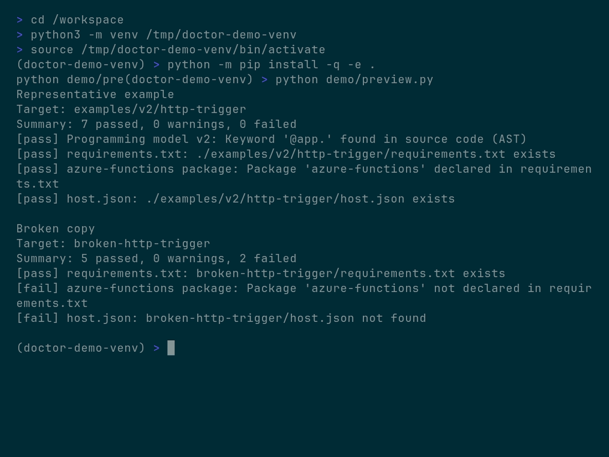

# Azure Functions Doctor

[](https://pypi.org/project/azure-functions-doctor/)
[](https://pypi.org/project/azure-functions-doctor/)
[](https://github.com/yeongseon/azure-functions-doctor/actions/workflows/ci-test.yml)
[](https://github.com/yeongseon/azure-functions-doctor/actions/workflows/release.yml)
[](https://github.com/yeongseon/azure-functions-doctor/actions/workflows/security.yml)
[](https://codecov.io/gh/yeongseon/azure-functions-doctor)
[](https://pre-commit.com/)
[](https://yeongseon.github.io/azure-functions-doctor/)
[](LICENSE)

其他语言: [English](README.md) | [한국어](README.ko.md) | [日本語](README.ja.md)

Azure Functions Doctor 是一个用于诊断基于 **Azure Functions Python v2 编程模型** 构建的项目的 CLI 工具。

它会检查本地项目中存在的常见问题，例如：

- 不支持的 Python 版本
- 缺失 `host.json` 或 `requirements.txt`
- 缺失 `azure-functions` 依赖项
- 缺失虚拟环境 (virtual environments)
- 缺失 Azure Functions Core Tools
- 本地开发环境配置不完整

## Why Use It

设置 Azure Functions Python 项目需要多个配置文件、依赖项和工具。缺少任何一个都会导致令人困惑的运行时错误。`azure-functions-doctor` 会根据精选的规则集检查项目，并在问题到达生产环境之前报告。

## Scope

本项目仅针对基于装饰器的 Azure Functions Python v2 编程模型。

- 支持的模型：使用 `@app.route()` 等装饰器的 `func.FunctionApp()`
- 不支持的模型：传统的基于 `function.json` 的 Python v1 项目

## Installation

从 PyPI 安装：

```bash
pip install azure-functions-doctor
```

从源码安装：

```bash
git clone https://github.com/yeongseon/azure-functions-doctor.git
cd azure-functions-doctor
python3 -m venv .venv
source .venv/bin/activate
pip install -e .
```

## Quick Start

在当前项目中运行 doctor：

```bash
azure-functions doctor
```

针对特定项目路径运行：

```bash
azure-functions doctor --path ./examples/v2/http-trigger
```

使用仅包含必要检查项的配置：

```bash
azure-functions doctor --profile minimal
```

为 CI 输出 JSON 格式：

```bash
azure-functions doctor --format json
```

## Demo

以下演示是使用 VHS 从 [`demo/doctor-demo.tape`](demo/doctor-demo.tape) 生成的。
它通过对代表性示例项目以及一个故意损坏的副本运行真实的 `azure-functions doctor` CLI，来展示成功与失败的对比。


最终的终端状态也被捕获为静态图像，以便快速查看。



## Features

默认规则集会验证以下内容：

- Azure Functions Python v2 装饰器的使用情况
- Python 版本
- 虚拟环境激活状态
- Python 可执行文件的可用性
- `requirements.txt`
- `azure-functions` 依赖声明
- `host.json`
- `local.settings.json` (可选)
- Azure Functions Core Tools 的存在及其版本 (可选)
- Durable Functions 主机配置 (可选)
- Application Insights 配置 (可选)
- `extensionBundle` 配置 (可选)
- ASGI/WSGI callable 的公开情况 (可选)
- 项目树中常见的冗余文件 (可选)

## Examples

- [examples/v2/http-trigger/README.md](examples/v2/http-trigger/README.md)
- [examples/v2/multi-trigger/README.md](examples/v2/multi-trigger/README.md)

## Requirements

- Python 3.10+
- 开发工作流所需的 Hatch
- 建议安装 Azure Functions Core Tools v4+ 以进行本地运行

## Documentation

- [docs/index.md](docs/index.md)
- [docs/usage.md](docs/usage.md)
- [docs/rules.md](docs/rules.md)
- [docs/diagnostics.md](docs/diagnostics.md)
- [docs/development.md](docs/development.md)

## Ecosystem

- [azure-functions-validation](https://github.com/yeongseon/azure-functions-validation) — 请求与响应校验
- [azure-functions-openapi](https://github.com/yeongseon/azure-functions-openapi) — OpenAPI 与 Swagger UI
- [azure-functions-logging](https://github.com/yeongseon/azure-functions-logging) — 结构化日志
- [azure-functions-scaffold](https://github.com/yeongseon/azure-functions-scaffold) — 项目脚手架
- [azure-functions-python-cookbook](https://github.com/yeongseon/azure-functions-python-cookbook) — 食谱与示例

## Disclaimer

本项目是独立的社区项目，与 Microsoft 没有关联，也未获得 Microsoft 的认可或维护。

Azure 和 Azure Functions 是 Microsoft Corporation 的商标。

## License

MIT
