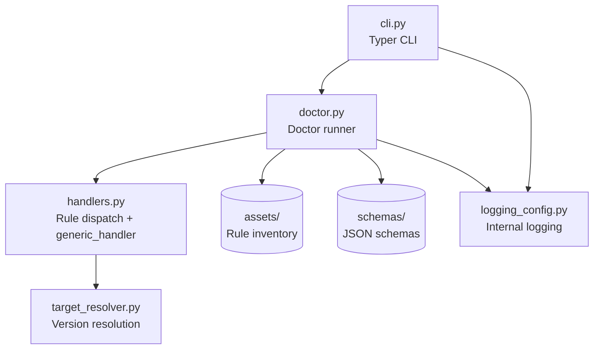
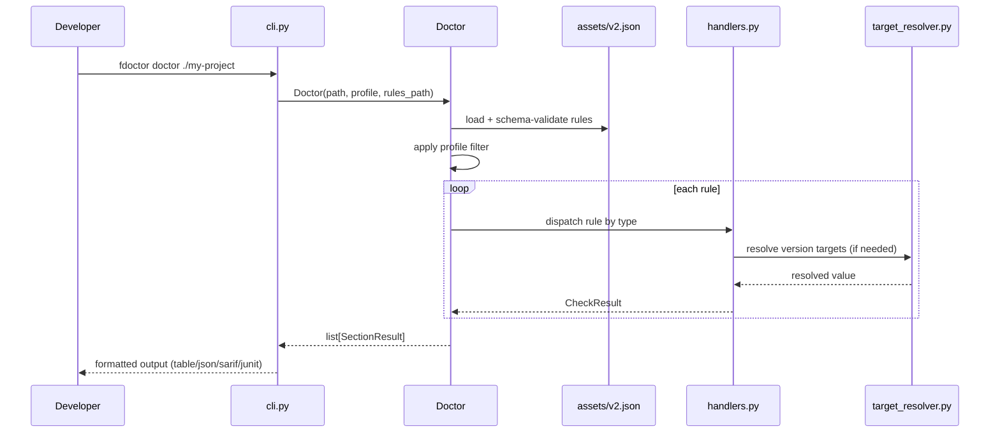

# Architecture

This document explains how `azure-functions-doctor` is structured internally and why key design choices support deterministic, actionable diagnostics.

## Design Objectives

The package is intentionally focused:

- Keep diagnostics rule-driven and data-defined (JSON rule assets, not hardcoded checks).
- Preserve exit-code-based CI integration as a first-class concern.
- Add invocation context without requiring heavy runtime dependencies.
- Stay dependency-light and operationally predictable.

## High-Level Components

Core modules and responsibilities:

- `__init__.py`: public exports and version string.
- `cli.py`: Typer-based CLI entrypoint; maps flags to `Doctor` options.
- `doctor.py`: `Doctor` runner — loads rules, executes handlers, aggregates results.
- `handlers.py`: `Rule` type, `generic_handler`, type-based rule dispatch via `HandlerRegistry`.
- `config.py`: configuration management (reserved for future use; not yet in the runtime path).
- `target_resolver.py`: resolves runtime values (Python version, Core Tools version) for version-comparison checks.
- `logging_config.py`: internal logging setup.
- `schemas/`: JSON schema definitions for rule assets.
- `assets/`: built-in rule inventory (e.g. `rules/v2.json`).

## Public API Boundary

Public symbols intentionally kept small:

- `Doctor`
- `__version__`
- `run_diagnostics()` (from `api.py` — programmatic entrypoint)

CLI is the primary consumer. Python import use is for programmatic embedding only.

## Module Boundaries

## Diagnostic Pipeline

`Doctor.run_all_checks()` is the entrypoint for a full diagnostic scan.

Execution flow:

1. Load rule asset (`assets/rules/v2.json`) or custom `rules_path`.
2. Validate rule asset against JSON schema.
3. Apply profile filter if `--profile` is given.
4. Dispatch each rule to its handler by the rule's `type` field.
5. Aggregate `SectionResult` list with per-item `CheckResult` entries.
6. Return `list[SectionResult]` — overall pass/fail status is derived later by the CLI.

## Rule Asset Design

Rules are data, not code:

- Each rule is a JSON object with `id`, `category`, `label`, `type`, `condition`, and optional `hint`.
- Handlers dispatch on the rule's `type` field and evaluate `condition` against the target project.
- New checks can be added without touching Python logic.

See [Rule Inventory](rule_inventory.md) and [RULE_POLICY](RULE_POLICY.md) for the full rule catalogue.

## Exit Code Contract

The CLI follows a strict exit code contract:

| Exit code | Meaning |
|---|---|
| `0` | No checks failed |
| `1` | One or more checks failed |
| `2` | Usage error (bad arguments) |

CI pipelines can rely on these codes directly. See [JSON Output Contract](json_output_contract.md) for structured output.

## Profile System

Profiles allow subsets of rules:

- Profile is a string selector (`minimal` or `full`), not a file-based system. `minimal` keeps only rules where `required=True` in the rule asset; `full` (the default) runs all rules.
- `--profile minimal` restricts the scan to required rules only.
- Custom profile names raise `ValueError`; only `minimal` and `full` are accepted.

See [Configuration](configuration.md) and [Minimal Profile](minimal_profile.md).

## Key Design Decisions

### 1. JSON rule assets over hardcoded checks

Every diagnostic check is defined as a JSON object in the rule inventory (`assets/rules/v2.json`). New checks are added by appending rule data — no Python handler changes required unless a new rule `type` is introduced.

### 2. HandlerRegistry type-based dispatch

`handlers.py` maintains a `HandlerRegistry` that maps rule `type` strings to handler functions. The `Doctor` runner dispatches each rule to its handler by type, enabling extensibility without modifying dispatch logic.

### 3. Exit code contract

`cli.py` sets exit code 1 explicitly when any check fails. Exit code 0 results from explicit `typer.Exit(0)` in structured-output paths and normal return in table mode. Exit code 2 is not explicitly coded — it is the default behaviour of Typer/Click when invoked with invalid arguments.

### 4. String-based profile selection

Profiles are not file-based. The `--profile` flag accepts `minimal` or `full` (default). `minimal` filters rules to those where `required=True` in the rule asset (`Doctor.run_all_checks()`). This avoids external profile file management while covering the common use case of gating CI on required rules only.

### 5. Typer CLI framework

The CLI uses Typer for argument parsing, help generation, and shell completion. This was chosen over argparse/Click for its decorator-driven API and automatic type inference from Python type hints.

## Related Documents

- [Usage Guide](usage.md)
- [Configuration](configuration.md)
- [Rules](rules.md)
- [Diagnostics](diagnostics.md)
- [Troubleshooting](troubleshooting.md)

## Sources

- [Azure Functions Python developer reference](https://learn.microsoft.com/en-us/azure/azure-functions/functions-reference-python)
- [Azure Functions host.json reference](https://learn.microsoft.com/en-us/azure/azure-functions/functions-host-json)
- [Supported languages in Azure Functions](https://learn.microsoft.com/en-us/azure/azure-functions/supported-languages)

## See Also

- [azure-functions-validation — Architecture](https://github.com/yeongseon/azure-functions-validation) — Request/response validation pipeline
- [azure-functions-openapi — Architecture](https://github.com/yeongseon/azure-functions-openapi) — OpenAPI spec generation
- [azure-functions-logging — Architecture](https://github.com/yeongseon/azure-functions-logging) — Structured logging with contextvars
- [azure-functions-scaffold — Architecture](https://github.com/yeongseon/azure-functions-scaffold) — Project scaffolding CLI
- [azure-functions-langgraph — Architecture](https://github.com/yeongseon/azure-functions-langgraph) — LangGraph agent deployment
